# ProseMirror 核心原理（程序员视角）

> 基于 https://prosemirror.net/docs/guide/ 官方指南整理，并结合本仓库（md-writer）的表格 / NodeView / 插件实现举例。

## 0. 全局图景：四模块 + 单向数据流

ProseMirror 不是开箱即用的编辑器，而是一套乐高。四个核心模块：

| 模块 | 职责 |
|---|---|
| `prosemirror-model` | 文档模型：不可变文档树、Schema、位置系统、DOM 解析/序列化 |
| `prosemirror-state` | 编辑器状态（doc + selection + storedMarks + 插件状态）、事务系统 |
| `prosemirror-view` | 视图：把 state 渲染为 contentEditable DOM，把用户交互翻译成 transaction |
| `prosemirror-transform` | 文档变换：Step 组成的可记录、可回放、可映射的变更流 |

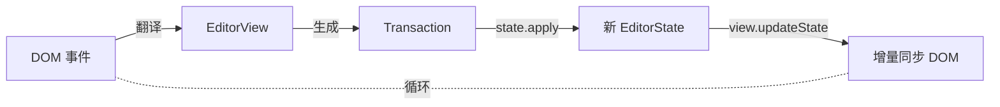

所有状态变更必须经过 `dispatchTransaction → updateState` 这一个漏斗。这是 PM "你的代码对文档拥有完全控制权" 的根基——任何变更都可以在单点被检查、修改或否决。

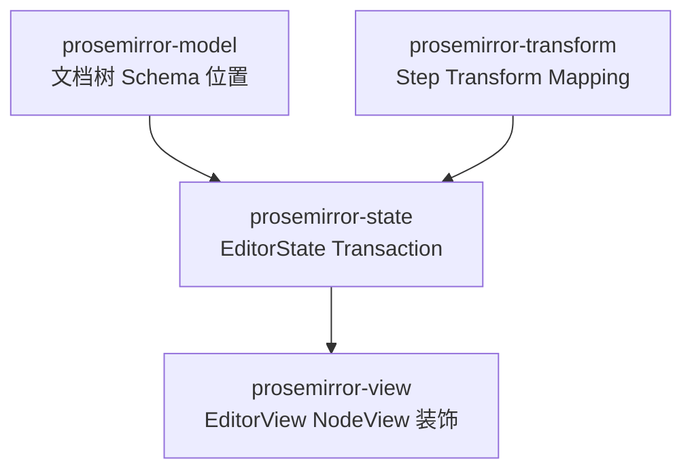

本仓库 `src/index.tsx` 创建 EditorView、`src/prosemirror/plugins.ts` 的 `buildPlugins` 装配插件，正是这个环的实例。

## 1. 文档模型（prosemirror-model）

### 1.1 树形结构，但内联内容是扁平的

文档是 `Node` 树（类似 DOM），但**关键差异**：文本与行内标记不成嵌套树，而是扁平序列 + 元数据。

HTML 里 `<p>This is <strong>a <em>b</em></strong></p>` 是三层嵌套；PM 里则是
`paragraph → [text("This is "), text("a b", marks=[strong]), text("b", marks=[strong, em])]`
——Mark 作为**属性附在文本节点上**，同 mark 集的相邻文本自动合并。

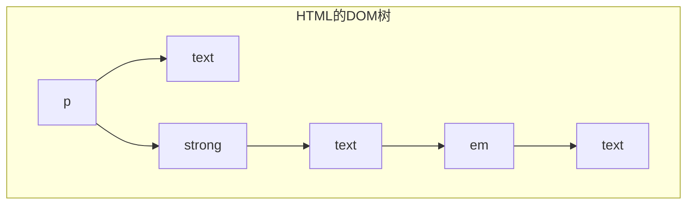

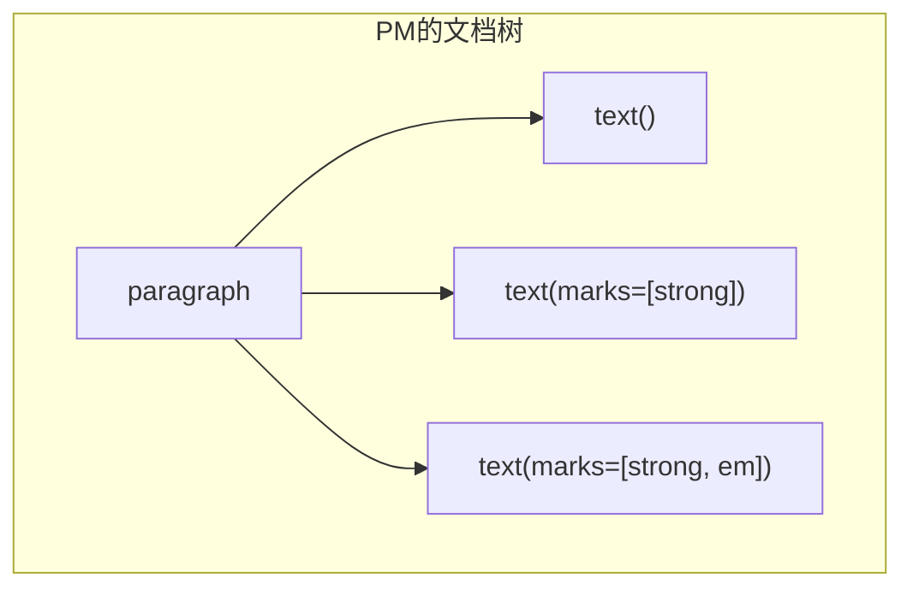

好处：
- 段内位置用**字符偏移**表示，而非树路径
- 加粗一段文字 = 改 mark 集合，不用做树手术
- 每个文档只有**唯一一种合法表示**，文档比较与 diff 更新可靠

### 1.2 节点是"值"（value），不是"对象"（object）

Node 像数字 `3` 一样是**不可变值**：可同时出现在多个文档中、没有父指针、更新时生成**新值**。新文档与旧文档**共享所有未变化的子树**，创建开销小。

推论：
- 不存在"更新到一半的非法中间状态"——新 state 原子换入
- View 可拿"上次画的文档 vs 新文档"做高效 diff
- 协作编辑、撤销历史因此成为可能

⚠️ JS 未强制冻结，但**永远不要手动改 Node/Fragment/marks 的属性**——它们几乎总被多处共享。

### 1.3 位置系统：树 + 扁平 token 双索引

每个位置是一个整数——token 序列索引。计数规则：

- 文档最开头是 0
- **进出每个非叶节点各占 1 个 token**（开/闭标签各算 1）
- 文本每个字符占 1
- 无内容叶节点（图片、hr）整体占 1

例：`<p>One</p><blockquote><p>Two</p></blockquote>`

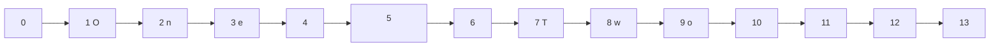

要点：
- 文档总大小是 `doc.content.size`，**不是** `doc.nodeSize`（外层开闭 token 不计入）
- 用 `doc.resolve(pos)` 得 `ResolvedPos`，直接给出父节点、父内偏移、祖先链
- 区分三种坐标：子索引（`child(i)`）、文档全局位置、节点内局部偏移——本仓库 `src/prosemirror/table.ts` 的 `findCellDepth` 大量依赖 `$from.depth` / `posAtIndex`，就是 ResolvedPos 的典型用法

### 1.4 Slice：带"开口"的内容片段

表示两个位置之间的内容（复制粘贴、拖拽），用 `Fragment + openStart/openEnd` 表示边缘节点被"切开"：

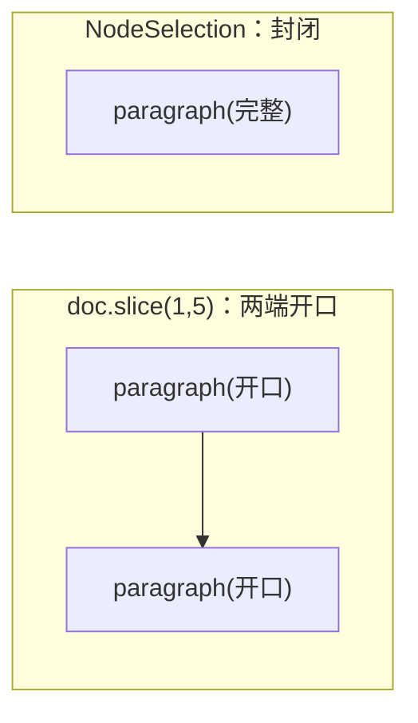

开口切片的内容可能局部不满足 schema（必要首节点落在切片外），插入时 PM 用 `createAndFill` 之类机制补齐。

## 2. Schema：文档的合法性宪法

Schema 枚举文档允许的节点类型、嵌套关系、mark 集、属性。**程序化创建节点必须经过 schema**（`schema.node(...)` / `schema.text(...)`）。

### 2.1 NodeSpec 的核心字段

以本仓库 `src/prosemirror/schema.ts:5` 的表格为例：

```ts
var tableSpec: NodeSpec = {
  group: "block",                          // 分组，供 content 表达式引用
  content: "(table_head | table_body)+",   // 内容表达式
  isolating: true,                          // 光标/退格不穿越该节点边界
  parseDOM: [{tag: "table"}],               // DOM → 模型 的解析规则
  toDOM: function () { return ["table", 0] }// 模型 → DOM；0 是内容"洞"
}
```

- **content 表达式**：类正则语法——`"paragraph+"`、`"block*"`、`"caption?"`、`{2,}`，`|` 表选择，group 名（如 `block`）展开为成员
- **顺序有语义**：自动补节点取表达式**第一个**类型；把会无限自递归的类型放首位会栈溢出
- **attrs**：`attrs: {level: {default: 1}}`。**无默认值的必填 attr 节点不能放在必填位置**——PM 需要能生成空节点填补约束
- **marks**：控制子节点允许的 mark 集；`"_"` 通配全部，`""` 为空集（如本仓库 `raw_block` 的 `marks: ""`）
- **inline: true** 标记行内节点；**text 类型是每个 schema 必须有的**

### 2.2 toDOM / parseDOM：模型与 DOM 的双向映射

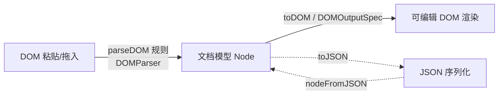

- `toDOM` 返回 DOMOutputSpec：`["p", 0]`（`0` 为内容洞）；mark 的 toDOM 必须单层包裹
- `parseDOM` 是规则数组：`{tag: "em"}`（CSS 选择器）、`{style: "font-style=italic"}` 等
- 另有内置 JSON 序列化：`node.toJSON()` / `schema.nodeFromJSON()`

### 2.3 扩展 schema

schema 的 `spec.nodes/marks` 是 OrderedMap，可 `addToEnd`/`remove` 派生新 schema。本仓库 `src/prosemirror/schema.ts:88` 正是以 `prosemirror-markdown` 的 schema 为基底，往末尾追加 table/raw_block 等自定义节点。

## 3. Transform 与 Step：可记录、可映射的变更

### 3.1 为什么不直接改文档

撤销历史（存 step 的逆）、协作编辑（step 可发送、可按序重排）、插件可逐个变更做反应——step 系统是三者的共同地基。

### 3.2 Step

- 每次修改分解为有序 **Step**（`ReplaceStep` 替换区间、`AddMarkStep` 加标记等）
- `step.apply(doc)` 返回 `StepResult`——**新文档或错误**。apply 是机械的，不会自作聪明补节点，所以可能失败
- `Transform` 是 step 的有序容器 + 便捷方法链（`delete/split/join/lift/wrap/addMark...`）

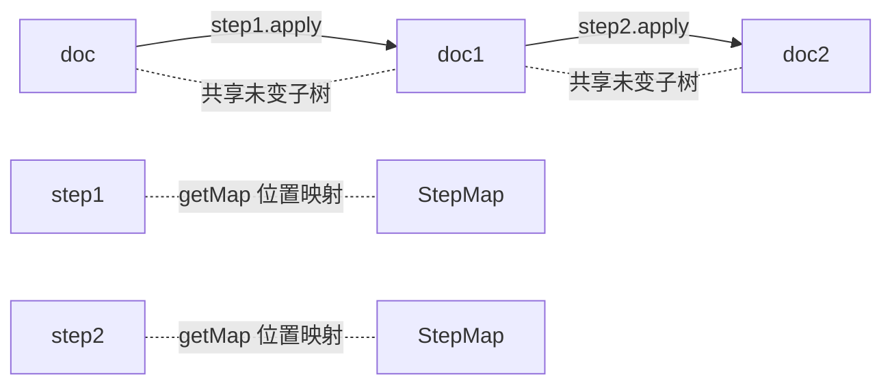

### 3.3 Mapping：位置穿越变更

文档变了，旧位置会失效/漂移。每个 step 附带 `StepMap`，把旧位置映射到新文档：

```js
tr.mapping.map(15)     // 15 → 14（前面删了内容）
tr.mapping.map(10, -1) // bias=-1：插入发生在该位置上时，留在插入内容之前
```

Selection 能"跟着编辑走"就是靠这个。**bias 参数**是关键——位置恰落在插入点时要选前还是选后。

### 3.4 Rebase（进阶，做协作/变更跟踪才需要）

把"基于同一旧文档的两条 step 序列"变换成可在对方结果上继续应用的序列：

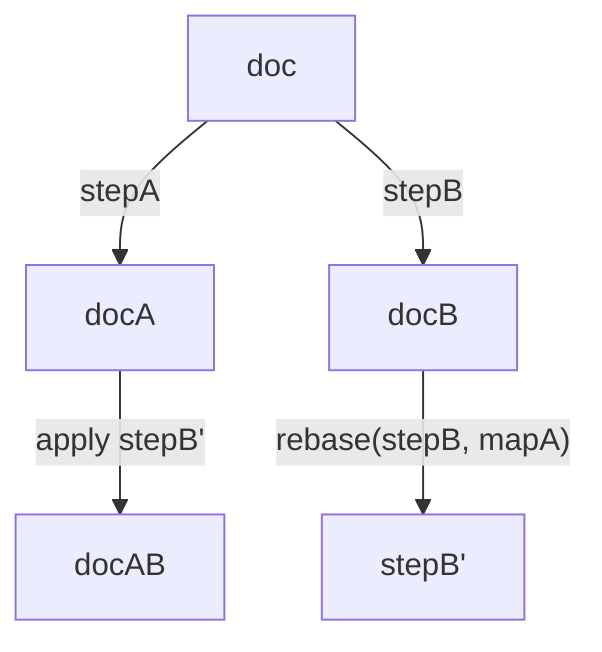

链式 rebase 需经过 `[invert(mapB1), mapA1, mapA2, mapB1']` 这样的映射管线，`Mapping` 抽象封装了管线（含前段 map 的逆）。rebase 后 step 仍可能无法应用，惯例是**丢弃**。

## 4. 编辑器状态与事务（prosemirror-state）

### 4.1 State 的组成

`EditorState` = `doc` + `selection` + `storedMarks` + 插件及其状态。State 不可变，靠 `state.apply(transaction)` 派生新 state。

### 4.2 Selection

- 不可变；有 `from/to`，多数还有 `anchor`（不动端）+ `head`（移动端）
- `TextSelection`：两端点必须在**行内位置**
- `NodeSelection`：选整个节点，范围是节点前到节点后
- 第三方可注册新 selection 类型（如 prosemirror-gapcursor 的 `GapCursor`——本仓库 `raw_block` 的 `createGapCursor: true` 给预览块前后提供可达光标）

### 4.3 Transaction

`Transaction extends Transform`，所以它**就是**一个 step 容器，另外携带：

- **selection 自动映射**：每个 step 后旧 selection 被映射；可 `setSelection` 显式设置
- `storedMarks`：文档/选区变化后自动清空（"还没开始输入的加粗状态"）
- `scrollIntoView()`
- **meta**：`tr.setMeta(key, value)`，键建议用插件对象本身防冲突。库保留键如 `"addToHistory": false`（不进撤销栈）、`"paste"`

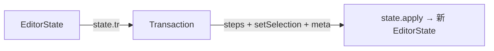

习惯写法：`state.tr` 创建空事务 → 加 step → `view.dispatch(tr)`。

## 5. 视图（prosemirror-view）

### 5.1 渲染与交互策略

View 用 schema 的 `toDOM` 渲染成 contentEditable DOM，并保持 **DOM selection 与 state.selection 同步**。PM 大量**借用浏览器原生能力**：

- 光标移动（含双向文本）交给浏览器，事后把 DOM selection 反解析成 `TextSelection`，不同才发 transaction
- 打字也让浏览器直接改 DOM，PM 察觉 DOM 变化后**重解析差异**生成 transaction（不破坏拼写检查、输入法）

### 5.2 高效更新

`updateState` 不重绘，而是**旧文档 vs 新文档**做 diff，未变节点的 DOM 原样保留：

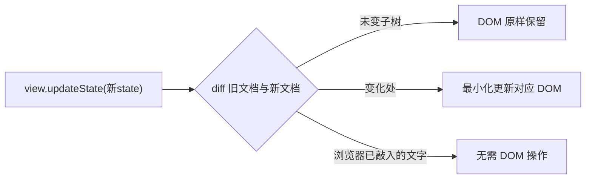

若 transaction 被拦截/修改，view 会**撤销 DOM 改动**保证同步。DOM selection 只在真正失同步时才写回（避免破坏浏览器随 selection 附带的隐藏状态，如上下方向键的水平位置记忆）。

### 5.3 Props

View 的行为参数：`state`、`editable`、各 `handle*` 事件回调、`dispatchTransaction` 等。插件也可声明 props（除 `state` 和 `dispatchTransaction` 外）。冲突规则三类：取第一个（如 `domParser`）、handler 返回 true 即接管短路（如 `handleKeyDown`）、取并集（如 `decorations`、`attributes`）。

`handleKeyDown` 的短路语义是本仓库键位链的基础：`src/prosemirror/plugins.ts` 里 Backspace 按序挂 `deleteSingleCellTable → deleteTableRow → guard(true) → deletePreviewRawBlock`，前面返回 true 后面就不执行。

### 5.4 装饰（Decorations）

不改文档、只改"画法"的三种装饰：

| 类型 | 作用 |
|---|---|
| Node 装饰 | 给单个节点的 DOM 加属性/样式 |
| Widget 装饰 | 在指定位置插入一个不属于文档的 DOM 节点 |
| Inline 装饰 | 给区间内行内内容加样式/属性 |

以 `DecorationSet.create(doc, [...])` 提供（集合结构模仿文档树以支持高效 diff/map）。量大时放进**插件状态**，在 `apply` 里 `set.map(tr.mapping, tr.doc)` 向前映射，只增量重建受影响子树。本仓库 grip 的显现机制（光标所在行列写 active 装饰类）就是装饰驱动 UI 的实例。

### 5.5 NodeView

为**单个节点**定义的微型 UI 组件，接管它的 DOM 渲染、更新与事件：

```ts
nodeViews: { image(node, view, getPos) { return new ImageView(node, view, getPos) } }
```

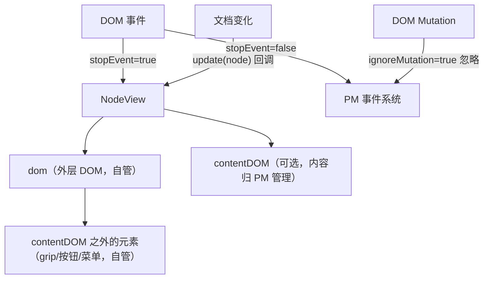

关键接口与语义（本仓库表格 NodeView 全部用到）：

- `dom`：外层 DOM；`contentDOM`：若提供，内容（渲染、更新、选择）归 PM；不提供则内容是黑盒
- `update(node)`：文档变化时被调用，返回 false 表示销毁重建。**此时 `contentDOM` 还是旧内容**——本仓库因此用 `update` 回调里 `scheduleRebuild`（rAF）重建 grip 而非同步读 DOM
- `stopEvent(event)`：返回 true 拦截命中该 view 的事件（如 handle 上的 mousedown）
- `ignoreMutation(record)`：告诉 PM 忽略某条 mutation。本仓库：cell 自身 attributes 变化忽略、handle 相关 mutation 全忽略——否则 readDOMChange 会解析坏表格
- `getPos()`：查询自身当前位置，配合 `setNodeMarkup` 改自身 attrs

分工总原则：`contentDOM` 内部归 PM，外部自管，靠 `stopEvent`/`ignoreMutation` 划清边界。

## 6. 插件系统

插件 = 行为扩展的统一载体，两部分能力：

```ts
new Plugin({
  state: {                         // 可选：自己的状态槽（必须不可变）
    init(_, state) { return ... },
    apply(tr, value, oldState, newState) { return value }
  },
  props: { handleKeyDown(view, event) { return false } }
})
```

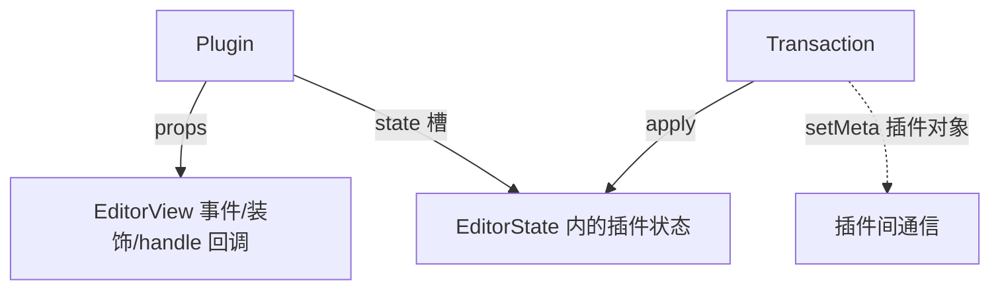

- 插件在 `EditorState.create({plugins})` 时注册（要参与事务处理），存在 state 里
- 插件状态不可变；读取用 `plugin.getState(state)`
- 用 `tr.setMeta(插件自身)` 做插件间通信与自我标记（如 history 的 undo 事务）

典型插件谱系：keymap（键→命令）、history（观察事务存逆操作）、inputrules、gapcursor，以及本仓库全部菜单/高亮/grip 插件。

## 7. Commands 与键映射

Command 是**约定签名的函数**：`(state, dispatch?, view?) => boolean`。

- 不可用 → 返回 false 且不做事；可用 →（有 dispatch 时）发事务并返回 true
- `dispatch` 可选让菜单能"预演"命令决定按钮是否置灰：`cmd(view.state, null)`
- `chainCommands(cmdA, cmdB, ...)`：依序尝试直到一个返回 true——本仓库所有键位链的构造方式

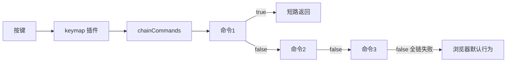

- 命令不一定发事务（也可弹对话框），但绝大多数是发事务
- 全链返回 false 时让浏览器走默认行为（如 textblock 内退格删字，保住拼写检查）

InputRule 是另一类"自动触发"：正则匹配输入文本，命中即用事务替换。本仓库 `wrappingInputRule`、`InputRule` 均用于 Markdown 快捷输入。

## 8. 协作编辑

PM 协作 = **中央权威（authority）+ step + rebase**：

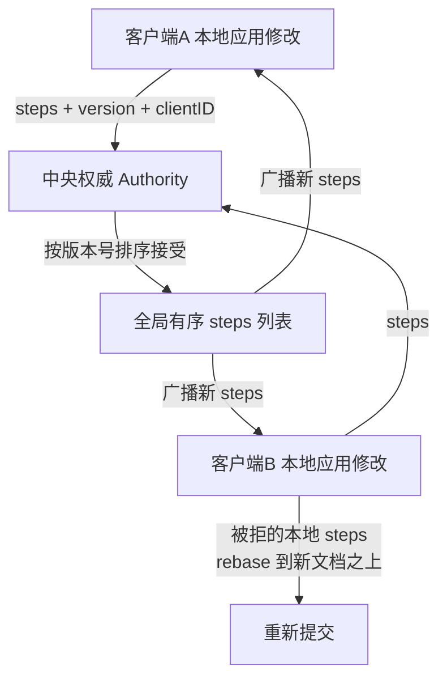

1. 每个客户端本地**立即**应用自己的修改，同时把 steps + 版本号 + clientID 发给 authority
2. Authority 维护全局有序 steps 列表（列表长度即版本），只接受**恰好基于当前版本**的提交；并发冲突者的提交被拒
3. 客户端收到远端 steps 时 `collab.receiveTransaction()` 合并进本地 state；自己被拒的 unconfirmed steps 被 **rebase** 到新文档之上，再重试提交
4. `collab({version})` 插件负责追踪本地未确认 steps（`sendableSteps`）与远端事务的接收

之所以可行，全靠第 3 节：step 可映射、可重放、应用结果确定。这是"不可变文档 + 可记录变更"设计红利的最终兑现。

## 9. 原理速查：本仓库实现 ↔ PM 机制对照

| md-writer 实现 | 对应 PM 原理 |
|---|---|
| `src/prosemirror/schema.ts:88` 以 markdown schema 派生新 schema | OrderedMap 派生扩展 |
| `table` 节点 `isolating: true`（schema.ts:8） | 阻断跨块编辑操作 |
| `raw_block` 的 `createGapCursor: true` | 自定义 selection 类型（GapCursor）补可达光标 |
| grip 直写 `td/th` + `ignoreMutation` | NodeView 对 contentDOM 外 DOM 的自管权 |
| grip `stopEvent` 拦截 handle 事件 | NodeView 事件边界 |
| `update` 回调 rAF 重建 | update 时 contentDOM 仍是旧内容 |
| 光标行列 active 装饰类驱动 grip 显隐 | Decoration + 插件状态 |
| Backspace 命令链（plugins.ts） | chainCommands + handleKeyDown 短路 |
| `guardTableCellDeletion`（table.ts） | 纯命令层拦截，不改 schema/文档 |
| fakeView 测试中手写 `endOfTextblock` | View props 是接口而非具体类，可注入测试替身 |

**一句话总结**：ProseMirror = 不可变文档树（带扁平内联层与整数位置系统）+ Schema 宪法 + 单点事务漏斗 + step 化变更记录（映射/撤销/协作的基础）+ 借力浏览器的增量 DOM 同步视图，插件通过 props 和状态槽把这一切组装成你想要的编辑器。
